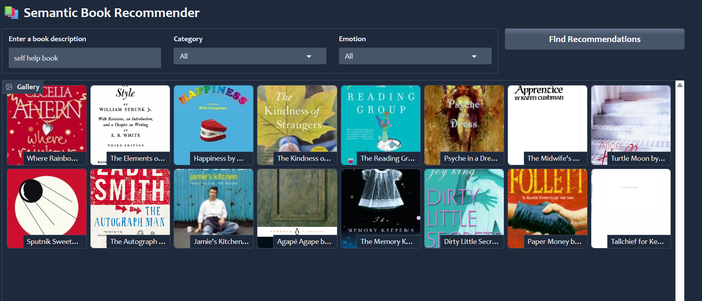

# 📚 Semantic Book Recommender System



---

## 🚀 Overview

This project builds an intelligent book recommendation system using modern Natural Language Processing (NLP) techniques. It allows users to search for books using natural language queries and receive recommendations based on semantic similarity, category filtering, and emotional tone.

---

## 🔑 Key Features

* **Semantic Search**: Retrieves books based on meaning (not keywords) using vector embeddings.
* **Vector Database**: Uses Chroma DB to store and query embeddings efficiently.
* **Zero-Shot Classification**: Classifies books into Fiction / Non-fiction without labeled training data.
* **Emotion Analysis**: Extracts emotional tone (joy, sadness, fear, etc.) from book descriptions.
* **Multi-Factor Ranking**:

  * Semantic similarity
  * Category filtering
  * Emotion-based sorting
* **Interactive UI**: Built using Gradio for real-time recommendations.

---

## 🏗️ Architecture Diagram

```
    A[User Query + Filters] --> B[Embedding Model (HuggingFace)]
    B --> C[Vector Database (Chroma)]
    C --> D[Top-K Similar Books]
    D --> E[Category Filter]
    E --> F[Emotion-Based Ranking]
    F --> G[Recommendation Engine]
    G --> H[Gradio UI Output]
```

---

## ⚙️ Tech Stack

* **Embeddings**: HuggingFace (sentence-transformers/all-mpnet-base-v2)
* **Vector Database**: Chroma
* **NLP Models**: Transformers (Zero-shot + Emotion Classification)
* **Backend**: Python
* **Frontend/UI**: Gradio
* **Data Processing**: Pandas, NumPy

---

## 📂 Project Structure

```
project/
│
├── data-exploration.ipynb        # Data cleaning & preprocessing
├── vector-search.ipynb          # Embeddings + vector DB creation
├── text-classification.ipynb    # Zero-shot classification
├── sentiment-analysis.ipynb     # Emotion extraction
├── gradio-dashboard.py          # Web app
├── books_with_emotions.csv      # Final dataset
├── tagged_description.txt       # Text corpus for embeddings
└── README.md
```

---

## 🔄 Workflow

### 1. Data Preprocessing

* Cleaned book metadata
* Handled missing values
* Prepared descriptions for NLP processing

### 2. Vector Search

* Converted book descriptions into embeddings
* Stored embeddings in Chroma vector DB
* Enabled semantic similarity search

### 3. Classification

* Used zero-shot classification to label books
* Categories: Fiction / Non-fiction

### 4. Emotion Analysis

* Extracted emotions from text:

  * Joy
  * Sadness
  * Fear
  * Anger
  * Surprise

### 5. Recommendation Logic

* Retrieve top-K similar books
* Apply category filter
* Rank by emotional tone

### 6. UI Layer

* User inputs query + filters
* Displays book recommendations with images

---

## 🧠 Key Concepts Used

* Vector Embeddings
* Semantic Search
* Zero-Shot Learning
* Sentiment Analysis
* Information Retrieval Systems

---

## 🚀 How to Run

### 1. Install dependencies

```
pip install -r requirements.txt
```

### 2. Run the app

```
python gradio-dashboard.py
```

### 3. Or in Jupyter

```
dashboard.launch()
```

---

## ⚠️ Notes

* First run may take time due to model downloads
* Fully local system (no API required)
* CPU-based execution (GPU optional)

---

## 👨‍💻 Author

**Aman Shah**
